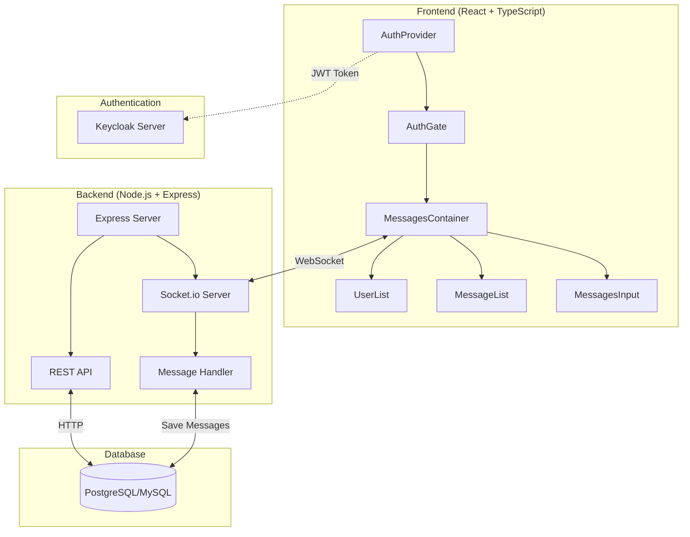
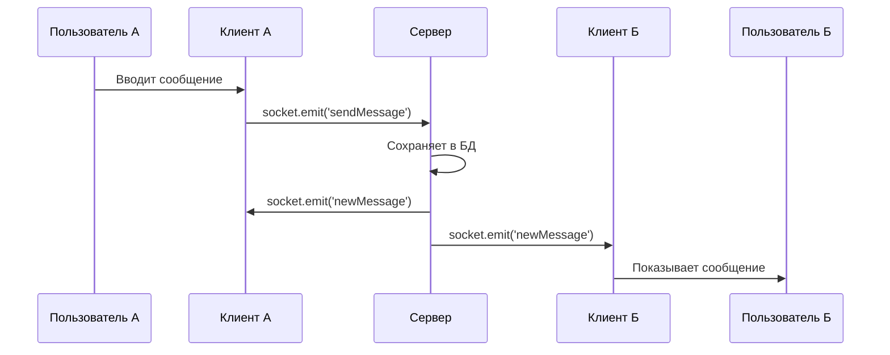
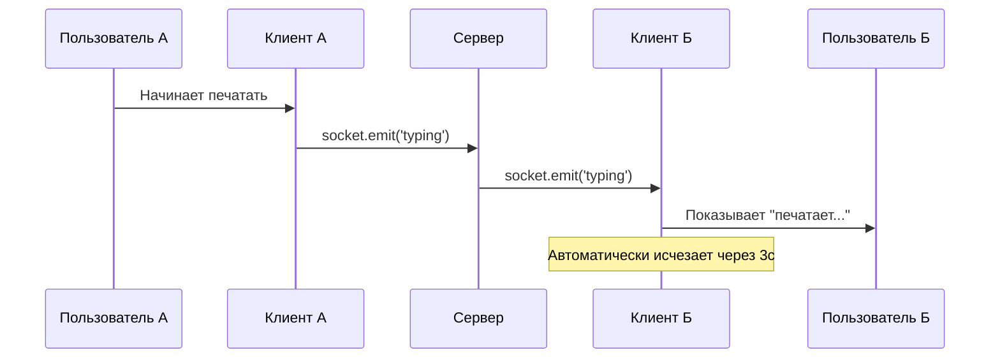

# 🚀 Keycloak Messenger

> **Современный веб-мессенджер с корпоративной аутентификацией**


---

## 📋 Описание проекта

**Keycloak Messenger** — это полнофункциональное приложение для обмена сообщениями в реальном времени с интеграцией корпоративной системы аутентификации Keycloak. Проект демонстрирует современные подходы к разработке веб-приложений с акцентом на безопасность и пользовательский опыт.

### ✨ Ключевые особенности

- 🔐 **Безопасная аутентификация** через Keycloak SSO
- 💬 **Мгновенные сообщения** с WebSocket
- 👀 **Индикатор печатания** в реальном времени
- 🎨 **Современный UI/UX** с адаптивным дизайном
- 🏗️ **Масштабируемая архитектура** с разделением на микросервисы
- 📱 **Отзывчивый дизайн** для всех устройств

---

## 🏛️ Архитектура системы



---

## 🛠️ Технологический стек

### Frontend
- **React 19** - Современная библиотека для UI
- **TypeScript** - Типизированный JavaScript
- **Socket.io Client** - WebSocket соединения
- **Keycloak-js** - Клиент аутентификации
- **Vite** - Быстрый сборщик проектов
- **CSS3** - Стилизация с анимациями

### Backend
- **Node.js** - Серверная среда выполнения
- **Express.js** - Веб-фреймворк
- **Socket.io** - Реальное время
- **TypeScript** - Типизация на сервере
- **JWT** - Токены аутентификации

### DevOps & Security
- **Keycloak** - Identity & Access Management
- **Docker** - Контейнеризация (опционально)
- **CORS** - Безопасность кросс-доменных запросов

---

## 🚀 Быстрый старт

### Предварительные требования

- Node.js 18+
- npm или yarn
- Keycloak Server (8080 порт)

### Установка и запуск

1. **Клонирование репозитория**
   ```bash
   git clone https://github.com/your-username/keycloak-messenger.git
   cd keycloak-messenger
   ```

2. **Настройка сервера**
   ```bash
   cd server
   npm install
   npm run dev
   ```

3. **Настройка клиента**
   ```bash
   cd client
   npm install
   npm run dev
   ```

4. **Настройка Keycloak**
   - Создайте realm: `Messenger`
   - Создайте клиента: `MessengerClient`
   - Настройте пользователей

### 🔧 Конфигурация

**Клиент:**
- URL Keycloak: `http://localhost:8080`
- Realm: `Messenger`
- Client ID: `MessengerClient`

**Сервер:**
- PORT: `3000`
- KEYCLOAK_URL: `http://localhost:8080`
- KEYCLOAK_REALM: `Messenger`

---

## 💡 Основные компоненты

### 🔐 Система аутентификации

**AuthContext** - Глобальное состояние аутентификации:
- Управляет состоянием входа пользователя
- Инициализирует Keycloak один раз при запуске
- Предоставляет данные аутентификации всему приложению
- Защищает от двойной инициализации в React.StrictMode

**AuthGate** - Компонент-охранник:
- Проверяет статус аутентификации
- Блокирует доступ неавторизованным пользователям
- Предоставляет кнопку выхода из системы

### 💬 Система сообщений

**MessagesContainer** - Центральный компонент чата:
- Управляет состоянием сообщений и пользователей
- Устанавливает WebSocket соединение для real-time общения
- Координирует работу всех дочерних компонентов
- Обрабатывает отправку сообщений и индикаторы печатания

**UserList** - Список контактов:
- Отображает всех доступных пользователей
- Позволяет выбрать собеседника для чата
- Выделяет активного пользователя

**MessageList** - Окно сообщений:
- Показывает историю переписки с выбранным пользователем
- Отображает индикатор "печатает..." в реальном времени
- Форматирует время отправки сообщений

**MessagesInput** - Поле ввода:
- Текстовое поле для набора сообщений
- Оптимизированная отправка событий печатания
- Отправка сообщений по Enter или кнопке

### 🎯 Индикатор печатания

**Принцип работы:**
- Отправляется только один раз в начале печатания
- Автоматически исчезает через 3 секунды
- Показывается только для текущего активного чата
- Использует WebSocket для мгновенной передачи

---

## 🎨 Пользовательский интерфейс

### Главный экран
```
┌─────────────────────────────────────────────────────────┐
│  🔐 Keycloak Messenger                    [Выйти] │
├─────────────────┬───────────────────────────────────────┤
│ 👥 Пользователи │ 💬 Чат с Иван Петров            [🗑️] │
│                 ├───────────────────────────────────────┤
│ • Иван Петров   │ Иван: Привет! Как дела?         12:30│
│ • Мария Сидорова│ Вы: Отлично, спасибо!           12:31│
│ • Петр Иванов   │ Иван печатает...                     │
│                 ├───────────────────────────────────────┤
│                 │ [Введите сообщение...    ] [Отправить]│
└─────────────────┴───────────────────────────────────────┘
```

### Особенности UI
- 🎨 **Современный дизайн** с градиентами и тенями
- 📱 **Адаптивная верстка** для мобильных устройств
- ✨ **Плавные анимации** переходов и появления элементов
- 🌙 **Готовность к темной теме** (легко добавить)

---

## 🔄 Поток данных

### Отправка сообщения


### Индикатор печатания


---

## 🔒 Безопасность

### Аутентификация
- ✅ **JWT токены** с автоматическим обновлением
- ✅ **Keycloak SSO** для централизованной аутентификации
- ✅ **Защищенные маршруты** на клиенте и сервере
- ✅ **Валидация токенов** на каждом запросе

### WebSocket безопасность
- **Middleware аутентификации** для проверки JWT токенов
- **Валидация токенов** при каждом WebSocket соединении
- **Привязка пользователя** к socket сессии
- **Автоматическое отключение** при невалидном токене

---

## 📊 Производительность

### Оптимизации
- ⚡ **Ленивая загрузка** компонентов
- 🎯 **Мемоизация** тяжелых вычислений
- 📦 **Сжатие** статических ресурсов
- 🔄 **Переиспользование** WebSocket соединений

### Метрики
- 🚀 **Время загрузки**: < 2 секунды
- 💾 **Размер бандла**: < 500KB (gzipped)
- 📡 **Задержка сообщений**: < 100ms
- 🔋 **Потребление памяти**: < 50MB

---

## 🧪 Тестирование

### Как протестировать
1. Откройте приложение в двух вкладках
2. Войдите под разными пользователями
3. Выберите друг друга в списке контактов
4. Отправьте сообщения
5. Проверьте индикатор "печатает..."

### Тестовые сценарии
- ✅ Аутентификация через Keycloak
- ✅ Отправка и получение сообщений
- ✅ Индикатор печатания
- ✅ Переключение между чатами
- ✅ Очистка истории сообщений

---

## 🚧 Планы развития

### Ближайшие обновления
- [ ] 📎 **Отправка файлов** и изображений
- [ ] 🔔 **Push-уведомления** для новых сообщений
- [ ] 👥 **Групповые чаты** с несколькими участниками
- [ ] 🌙 **Темная тема** интерфейса
- [ ] 📱 **Мобильное приложение** (React Native)

### Долгосрочные цели
- [ ] 🎥 **Видеозвонки** через WebRTC
- [ ] 🤖 **Чат-боты** и интеграции
- [ ] 📊 **Аналитика** использования
- [ ] 🌍 **Интернационализация** (i18n)
- [ ] ☁️ **Облачное развертывание** (AWS/Azure)

---

## 👨‍💻 Автор

**Ваше имя**
- 📧 Email: your.email@example.com
- 🐙 GitHub: [programmer-alt](https://github.com/programmer-alt)

---

## 📄 Лицензия

Этот проект распространяется под лицензией MIT. См. файл [LICENSE](LICENSE) для подробностей.

---

## 🙏 Благодарности

- **Keycloak** за отличную систему аутентификации
- **Socket.io** за простую работу с WebSocket
- **React** команду за потрясающую библиотеку
- **TypeScript** за типизацию JavaScript

---

<div align="center">

**⭐ Поставьте звезду, если проект был полезен!**

Made with ❤️ and ☕

</div>